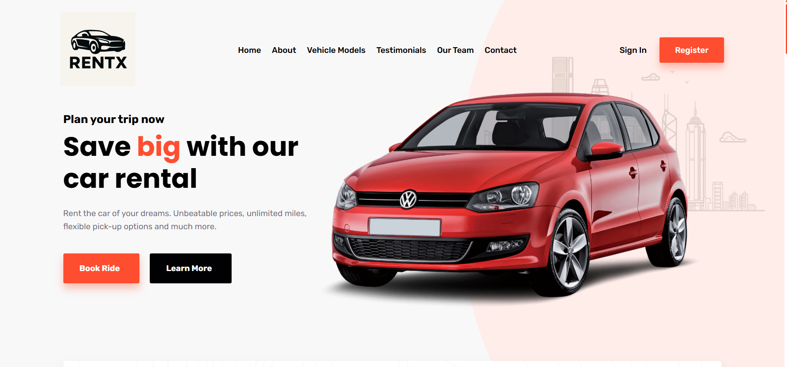
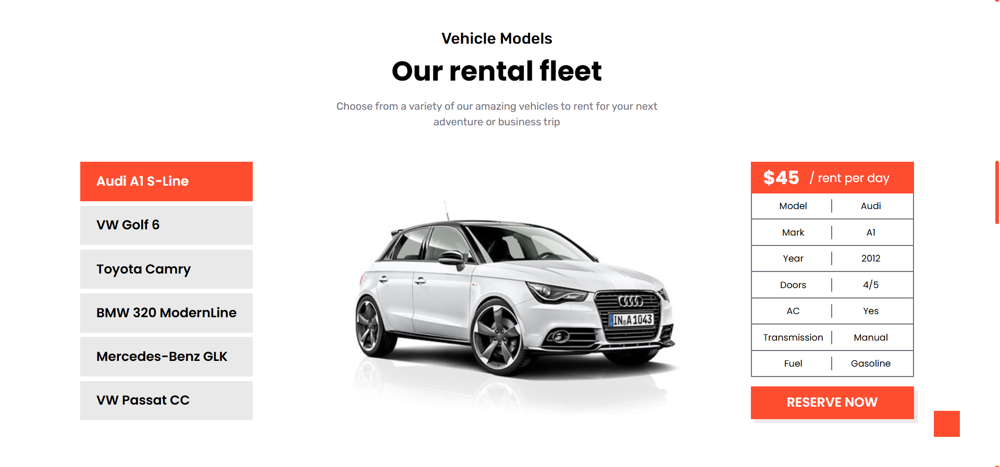

# 🚗 Car Rental Website

A *Car Rental Website* is an online platform where users can easily rent cars for personal or business use.  
The website offers a simple interface for searching, comparing, and reserving cars from a wide range of vehicles by *make, model, size, and price*.  
---

## 🛠 Built With
- *React JS*  
- *CSS* for styling  

---

## ⚙ React Project Setup

Follow these steps to set up and run the project locally.  

### ✅ Prerequisites
Make sure you have installed:  
- *Node.js* (v12 or later)  
- *npm* (comes with Node.js)  

---

### 📥 Installation

1. Clone the repository
```bash
git clone https://github.com/rishikandagatla/rentx.git
```
2. Navigate to the project directory
```bash
cd rentx
```
3. Install dependencies
```bash
npm install
```
4. 🚀 Run the Project
```bash
npm start
```
The app will compile and start a local server at:
🔗 http://localhost:3000
---
🖼 Screenshots
### Homepage 
### About Us Page 
### Car Selection 
### Why Us Page 
---
## 📝 Conclusion 
You now have the Car Rental Website running on your local machine! Feel free to explore, modify, and improve it. If you face any issues, check the documentation or ask for help in the community.
